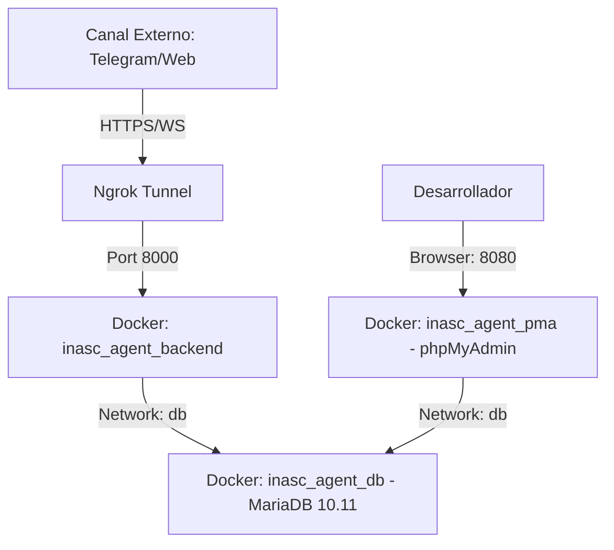

# Blueprint de Arquitectura: Del Asistente General al Bot de Captación de Leads

Este documento detalla la arquitectura fundacional construida en el proyecto actual (anteriormente Andrew Martin) y cómo esta base robusta, orientada a objetos y basada en principios SOLID, sirve como la plataforma ideal para construir un **Chatbot Automatizado de Atención al Cliente y Captación de Leads**.

---

## 🏗️ 1. Arquitectura Base del Sistema (Estado Actual)

La solución actual está diseñada bajo una arquitectura modular y escalable que separa claramente las responsabilidades, permitiendo que el cerebro del LLM opere independientemente de los canales de entrada o almacenamiento.

### 1.1 Patrón Productor-Consumidor (Ingesta Multicanal)
- **Principio:** Desacopla la recepción de mensajes del procesamiento de la IA.
- **Implementación:** Se utiliza una `asyncio.Queue` central. Clases especializadas que heredan de `BaseProducer` (
  `WebSocketProducer`, `TelegramProducer`, `WhatsAppProducer`) normalizan el payload de cada canal hacia el modelo
  estándar `IncomingMessage` antes de encolarlo.
- **Estado:** Los tres canales están implementados y testeados (14 + 8 + 8 tests). Añadir un canal nuevo
  (Signal, Email, etc.) requiere únicamente un nuevo `XProducer`, un `XResponder` y un `elif` en `main.py`.

### 1.2 Registro Dinámico de Herramientas (Skill Orchestration)
- **Principio:** Carga Perezosa (Lazy Loading) y Principio de Abierto/Cerrado (OCP).
- **Implementación:** Un decorador personalizado `@tool` enlaza funciones Python directamente con el esquema esperado por OpenAI. El [SkillManager](file:///y:/MySource/IA/Agent-Telegram/src/core/skill_manager.py#28-62) carga dinámicamente "Skills" (grupos de herramientas) bajo demanda usando `importlib`.
- **Ventaja para el nuevo Bot:** El bot inicia ligero. Si la conversación determina que el cliente pregunta por ventas, se activa el skill *SalesTools*; si pregunta por soporte técnico, se activa *SupportTools*.

### 1.3 Subsistema de Seguridad
- **Configuración (`SecurityConfig`):** Límites estrictos de tokens, temperaturas bajas para mantener al bot determinista y evitar alucinaciones con clientes reales.
- **Detector de Amenazas (`ThreatDetector`):** Evita el *Prompt Injection*. Crucial en un entorno de atención al cliente público para evitar que usuarios malintencionados secuestren al bot.
- **Auditoría (`SecurityLogger`):** Registro inmutable de interacciones sospechosas, vital para el cumplimiento (Compliance) corporativo.

### 1.4 Capa de Persistencia y Memoria a Largo Plazo
- **Historial de Interacciones ([HistoryManager](file:///y:/MySource/IA/Agent-Telegram/src/core/persistence/history_manager.py#9-71)):** Mantiene la ventana de contexto de la conversación activa.
- **Extracción de Inteligencia ([IntelligenceExtractor](file:///y:/MySource/IA/Agent-Telegram/src/core/persistence/extractor.py#10-75)):** Un proceso asíncrono que analiza conversaciones inactivas para extraer y guardar datos clave (entidades, preferencias) en la base de datos de conocimiento.
- **Consolidación de Memoria ([MemoryConsolidator](file:///y:/MySource/IA/Agent-Telegram/src/core/persistence/memory_consolidator.py#10-68)):** Resume conversaciones largas para mantener el contexto histórico sin saturar el límite de tokens del LLM.

---

## 🎯 2. Diseño del Nuevo Bot: Atención al Cliente y Captación de Leads

El objetivo primordial del nuevo bot es recibir a clientes potenciales que llegan vía links de WhatsApp/Telegram desde la web corporativa, cualificarlos de manera conversacional, capturar sus datos y entender su problema específico.

### 2.1 Flujo Operativo Esperado

1. **Aterrizaje (Landing):** El usuario hace clic en un enlace web (`wa.me/num?text=Hola,%20necesito%20info`).
2. **Triaje Conversacional:** El bot utiliza un LLM guiado por *System Prompts* estrictos para preguntar de forma natural sobre el problema del usuario sin parecer un formulario rígido.
3. **Extracción Paralela:** Mientras conversan, el subsistema de Persistencia (o herramientas específicas activadas dinámicamente) extrae entidades clave: *Nombre, Empresa, Correo, Descripción del Problema*.
4. **Cualificación:** El bot determina si es un "Lead Caliente", una duda de soporte o SPAM.

### 2.2 Adaptación de la Arquitectura Actual

Para transformar la base actual en el bot comercial, se deben crear los siguientes **Nuevos Skills (Grupos de Herramientas)**:

| Nombre del Skill | Herramientas Inyectadas vía `@tool` | Propósito |
| :--- | :--- | :--- |
| `lead_capture` | `verify_email_format`, `save_temp_lead_data` | Validar y almacenar temporalmente en memoria los datos que el usuario va dictando. |
| `crm_integration` | `push_lead_to_crm`, `create_support_ticket` | Enviar el paquete consolidado de datos al CRM de la empresa cuando la cualificación termine. |
| `product_kb` | `search_product_catalog`, `get_pricing_tier` | Contexto RAG (Retrieval-Augmented Generation). Permite al bot responder preguntas sobre servicios basándose en la documentación oficial de la empresa. |

---

## 📋 3. Requisitos de Información y Formato de Salida

Para que el bot sea efectivo como herramienta de Ventas/Soporte, debe estructurar la información obtenida de la charla informal en un formato procesable por el backend de la empresa.

### 3.1 Lo que el Bot DEBE capturar (El Payload del Lead)
El *System Prompt* instruirá al LLM para no terminar la conversación de captación hasta no tener, al menos, la siguiente estructura consolidada (ya sea extrayéndola o preguntándola sutilmente):

```json
{
  "lead_id": "generado_automaticamente",
  "contact_info": {
    "name": "Obligatorio",
    "phone_or_username": "@usuario_telegram_o_wa",
    "email": "Obligatorio"
  },
  "business_context": {
    "company_name": "Opcional",
    "interest_area": "Ventas | Soporte | Facturación | Otro"
  },
  "problem_statement": "Resumen de 2-3 líneas generado por el LLM sobre lo que el cliente realmente necesita resolver.",
  "urgency_level": "Alto | Medio | Bajo (Calculado por análisis de sentimiento del bot)"
}
```

### 3.2 Cómo se le presenta la información al Usuario Final
- **Formato Conversacional Corto:** Los mensajes del bot vía WA/TG deben ser de **máximo 2 párrafos**.
- **Evitar Markdown Complejo:** Muchos clientes en WhatsApp no leen bien formatos complejos. Se usarán emojis estratégicos y negritas simples (`*texto*`).
- **Llamados a la Acción (CTA) Claros:** Siempre terminar con una pregunta clara, ej: *"Comprendo el problema con el tiempo de entrega requerido. ¿Podrías indicarme a qué correo podemos enviarle la propuesta técnica, que incluya esta información?"*

### 3.3 El Proceso de Entrega (Handoff)
Una vez que el JSON (Sección 3.1) está completo, el bot ejecutará la herramienta `push_lead_to_crm(payload)`. 
* Si es soporte crítico, la herramienta avisará a un humano (vía Slack/Teams) para tomar control de la sesión (Handoff).
* El bot responderá al usuario: *"¡Perfecto Ing Lopez! He registrado su caso. Un asesor técnico revisará los detalles y te contactará en breve."*

---

## ⚡ 4. Escalabilidad del Motor LLM: Pool Dinámico de API Keys (RF06)

### 4.1 Problema que Resuelve

El rate-limit del proveedor LLM (DeepSeek) se aplica **por API Key**. Con una sola key compartida entre todos los tenants y prospectos, los clientes compiten por el mismo budget de requests/minuto. Bajo alta concurrencia esto produce errores `429 Too Many Requests` y degradación perceptible de la experiencia del usuario.

### 4.2 Componente: `LLMKeyPool`

Se introducirá el componente `LLMKeyPool` (singleton) que reemplaza al actual `LLMEngine` singleton de key única. Mantiene un pool de clientes `AsyncOpenAI`, cada uno con su propia API Key (y por ende su propio budget de rate-limit independiente).

```
                    ┌─────────────────────────────┐
process_single_     │        LLMKeyPool           │
message(msg)───────►│  acquire(conversation_id)   │
                    │                             │
                    │  Key A: 8 conversaciones    │
                    │  Key B: 3 ← asignar esta    │
                    │  Key C: 11 conversaciones   │
                    │                             │
                    │  release(conversation_id)   │
                    └─────────────────────────────┘
```

**Regla de asignación:** *Least-Connections* — se asigna la key con menor número de conversaciones activas en ese instante.

**Pinning por conversación:** Una vez asignada, la conversación queda "pinneada" a esa key durante toda su duración. Se libera automáticamente al recibir el evento `WebSocketDisconnect` del `ConnectionManager`.

### 4.3 Punto de Extensión en el Código Actual

El `tenant_id` y el `platform_user_id` ya viajan hasta `generate_response()` en `llm.py`. El cambio es quirúrgico: solo afecta a `LLMEngine` → `LLMKeyPool` y al endpoint `/health` → `/metrics`. **El Queue, el ConnectionManager, los Producers y la BD no se modifican.**

### 4.4 Endpoint de Monitoreo `/metrics`

```json
{
  "pool_status": [
    { "key_id": "key_a", "active_conversations": 8,  "capacity_pct": 53 },
    { "key_id": "key_b", "active_conversations": 3,  "capacity_pct": 20 },
    { "key_id": "key_c", "active_conversations": 11, "capacity_pct": 73 }
  ],
  "total_active": 22,
  "pool_capacity_pct": 49,
  "alert": false
}
```

- **Umbral de alerta:** `pool_capacity_pct >= 80` sostenido en horas pico → señal para adquirir cuentas adicionales.
- **Tope por key:** calculado empíricamente con los tests de rendimiento (Locust) — aproximadamente `RPM_limite / mensajes_promedio_por_minuto_por_conversacion`.

---

## 🛠️ Conclusión Técnica para el Equipo Backend

La migración hacia este nuevo bot requiere **modificar menos del 15% del núcleo del sistema actual**. El esfuerzo principal radicará en:
1. Escribir el nuevo *System Prompt* central (Rol: Asesor Comercial Especializado).
2. Desarrollar las herramientas del skill `crm_integration`.
3. Integrar un nuevo productor (ej. la API de WhatsApp Business o Twilio) heredando del [BaseProducer](file:///y:/MySource/IA/Agent-Telegram/src/core/producers/base.py#5-27) ya construido.

---

## 🌐 5. Infraestructura por Entorno

### 5.1 Entorno de Desarrollo (Dockerized)

Para el desarrollo y pruebas se utiliza un entorno completamente Dockerizado. Esto garantiza que la base de datos, el backend y las herramientas de gestión (phpMyAdmin) corran de forma idéntica en cualquier máquina.



**Componentes del entorno de desarrollo:**

| Componente | Imagen / Versión | Puerto Local |
|---|---|---|
| **Backend** | `python:3.11-slim` (Custom) | `8000` |
| **Base de Datos** | `mariadb:10.11` | `3307` (EXT) / `3306` (INT) |
| **Gestión DB** | `phpmyadmin:latest` | `8080` |
| **Túnel** | `ngrok` | Dinámico (HTTPS) |

**Comandos clave:**
- **Arranque**: `docker-compose up -d --build`
- **Migraciones**: `docker exec inasc_agent_backend alembic upgrade head`
- **Logs**: `docker logs -f inasc_agent_backend`

---

### 5.2 Entorno de Producción (VPS Hostinger)

Para producción, el sistema corre en un **VPS Hostinger KVM** con IP pública fija, Nginx como proxy inverso y Docker para el aislamiento del agente.

**Infraestructura contratada (pendiente de aprovisionamiento):**
- **Proveedor:** Hostinger (cuenta existente: `u851602756`)
- **Plan hosting actual:** Premium Web Hosting (shared) — **no apto** para correr daemons Python
- **Plan a contratar:** VPS KVM1 (~USD 5–10/mes) con IP pública dedicada

```
[Bot Telegram]
      │
      │  HTTPS POST
      ▼
https://inasc.com.co/webhook/telegram   ← Nginx (SSL terminado, Let's Encrypt)
      │
      │  proxy_pass http://127.0.0.1:8000
      ▼
Docker container: agent-commercial (FastAPI + uvicorn)
      │
      ▼
Docker container: mysql (o MySQL del hosting compartido vía TCP externo)
```

**Stack de producción:**

| Capa | Tecnología | Notas |
|---|---|---|
| SO | Ubuntu 22.04 LTS | Imagen estándar Hostinger VPS |
| Proxy inverso | Nginx + Let's Encrypt | SSL automático |
| Runtime | Docker + docker-compose | Definido en `docker-compose.yml` (por implementar) |
| Agente | `agent-commercial` container | Puerto interno 8000 |
| BD | MySQL (mismo VPS o externo) | Credenciales en `.env` de producción |
| Registro webhook | URL fija del VPS | Solo se registra una vez en Telegram |

**Nota de migración:** la URL del webhook de Telegram debe actualizarse llamando a `setWebhook` con la nueva URL del VPS cuando se migre de desarrollo a producción. El bot de Telegram solo acepta un webhook activo a la vez.
