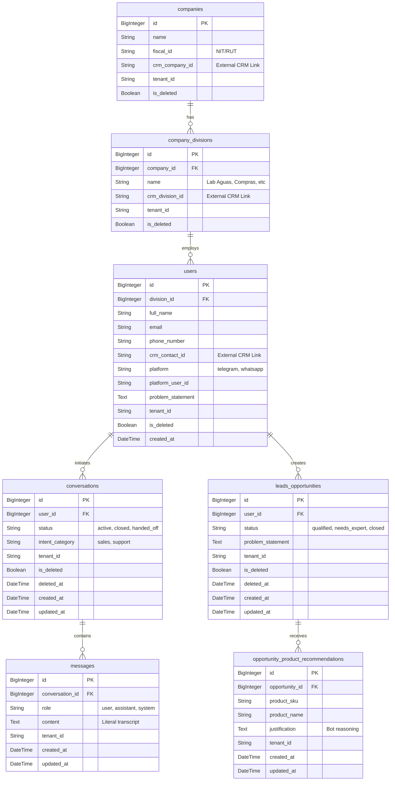

# Agente Comercial IA Multi-Canal (FastAPI + DeepSeek)

Este proyecto es un **Agente Conversacional Multi-Tenant** diseñado primariamente para ventas técnicas y asesoramiento de productos en B2B.

Se despliega a través de múltiples canales (Widgets Web, Telegram, WhatsApp) utilizando una arquitectura verdaderamente asíncrona en Python, permitiendo concurrencia masiva sin bloqueos.

---

## 🏗️ Stack Tecnológico y Arquitectura

El sistema está construido bajo un patrón **Modular (Layered MVC)** que separa claramente el dominio del Chat, la lógica del Agente LLM, y el almacenamiento en Base de Datos.

*   **Motor (Framework):** `FastAPI` + `uvicorn` (Para máxima velocidad asíncrona y webhooks en tiempo real).
*   **Inteligencia Artificial:** OpenAI Proxy SDK consumiendo la API de **DeepSeek Chat**.
*   **Base de Datos Relacional:** `MySQL` operado mediante `SQLAlchemy` (ORM) en modo asíncrono puro (`aiomysql`). Las migraciones son manejadas por **Alembic**.
*   **Memoria de Larga Duración (Vector DB):** `ChromaDB` (Local) impulsado por `sentence-transformers`. Aquí se indexa el catálogo de productos para búsqueda semántica (RAG).
*   **Concurrencia:** Python `asyncio` nativo (sin Celery o Celery workers) respaldado por WebSockets.
*   **Limpieza de Datos:** `BeautifulSoup4` para normalizar las ricas descripciones HTML heredadas del catálogo corporativo original.

---

## 🗄️ Esquema de Base de Datos (Multi-Tenant)

El sistema fue diseñado desde el primer día para ser **SaaS Ready**. Cada tabla crítica en la base de datos (Ej: `users`, `conversations`, `leads_opportunities`) está forzada a heredar de tres Mixins de SQLAlchemy:
1.  **`TenantMixin`:** Aísla la información inyectando un `tenant_id` duro a cada registro.
2.  **`SoftDeleteMixin`:** Evita la eliminación física de registros agregando `is_deleted` y `deleted_at`.
3.  **`AuditableMixin`:** Rastrea silenciosamente `created_at` y `updated_at`.



---

## 🔌 Integración Futura con CRM

El agente está diseñado desde la base de datos para funcionar de manera simbiótica con cualquier CRM moderno (Especialmente para integraciones SaaS B2B). Las reglas arquitectónicas implementadas son:

1. **Jerarquía B2B estricta (Estilo LDAP):** En la base de datos, un Agente/Prospecto (`User`) pertenece inevitablemente a un Laboratorio/Área (`CompanyDivision`) que a su vez consolida dentro de un Cliente Principal (`Company`).
2. **Sincronización Bidireccional de IDs:** Todas las entidades core contemplan un campo `crm_*_id` (Ej: `crm_contact_id`, `crm_company_id`). Si el bot es invocado *desde* la UI de un CRM existente, el CRM puede enviar su ID único para inyectar contexto histórico al Agente de forma transparente.
3. **Inyección Dinámica de Contexto:** A través del Pydantic Model `IncomingMessage.metadata`, las integraciones externas (CRMs o ERPs) pueden pasar variables enriquecidas al vuelo (Ej. "Es un cliente VIP", "Tiene Ticket Fallando"), que el agente inyecta en su **SYSTEM PROMPT** para brindar soporte personalizado.
4. **Respeto Multi-Tenant:** Ninguna integración dependerá de variables o IDs "quemados" (Hardcoded). Todo el aislamiento se rige por el paso obligatorio del token/llave `tenant_id` en cada conexión o consulta a base de datos.
 
---

## 🧠 El Cerebro Asíncrono (Async Brain)

A diferencia de los orquestadores lang-chain/auto-gpt síncronos tradicionales, este agente no bloquea el hilo principal del servidor de API mientras "piensa" o llama a ChatGPT.

Cada webhook entrante empuja el mensaje a una cola de eventos asíncrona no bloqueante. El controlador de FastAPI se desliga inmediatamente y devuelve un `200 OK` a Telegram/WhatsApp, mientras la "Máquina de Estados" del LLM se ejecuta en tareas en segundo plano (`asyncio.create_task()`).

---

## ⚙️ Flujo de Trabajo y Ramas (Git Flow)

Este proyecto se maneja estrictamente usando **Issues**. Ninguna funcionalidad (feature) nueva ni corrección de bug se aplica directamente a la rama `main`.

1. Se reporta un requerimiento creando un **Issue**.
2. Se genera una rama derivada (`feature/ID-nombre`).
3. Se consolida a través de un Commit/Merge.

---

## 🚀 Despliegue Local (Docker)

1. Renombra `.env.example` a `.env` y añade tus credenciales (API keys, Config MySQL).
2. Construye y levanta el contenedor:
   ```bash
   docker-compose up -d --build
   ```
3. Ejecuta las migraciones de Base de datos:
   ```bash
   docker exec -it inasc_agent_backend alembic upgrade head
   ```

---

## 🧪 Estrategia de Calidad y Pruebas (Test-Driven)

Para asegurar la fiabilidad del agente autónomo, el proyecto requiere validación estricta utilizando el framework `pytest`. La estructura de pruebas está dividida en 3 carpetas dentro de `/tests`:

1.  **Unit Tests (`tests/unit/`):** Validan módulos aislados y lógica pura de negocio (por ejemplo, el formateo de prompts o la capa de integración del LLM) mockeando las dependencias externas.
2.  **Integration Tests (`tests/integration/`):** Comprueban la interacción real entre SQLAlchemy + MariaDB + Asyncio. Verifican que el flujo completo de persistencia funciona correctamente (crear usuario, abrir conversación, guardar mensajes, recuperar historial).
3.  **Functional Tests (`tests/functional/`):** Simulan el comportamiento end-to-end inyectando Webhooks completos contra FastAPI.

### Prerequisito: Base de datos de pruebas

Los tests de integración corren contra una base de datos MariaDB aislada (`comm_agent_test`). Para crearla la primera vez:
```bash
python create_test_db.py
```

### Correr los tests de integración

```bash
venv/Scripts/python.exe -m pytest tests/integration/ -v
```

**Resultado actual (Issue #3):**
```
tests/integration/test_crud.py::test_create_and_link_b2b_hierarchy  PASSED
tests/integration/test_crud.py::test_crud_chat_flow                  PASSED
2 passed, 0 warnings
```

