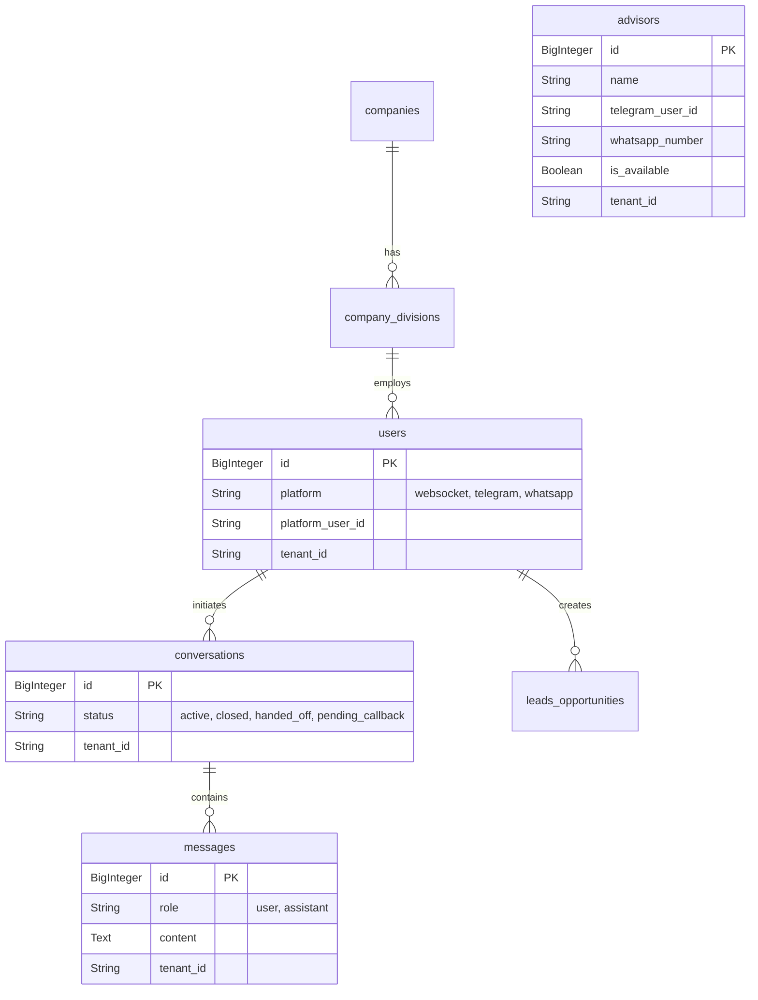

# Agente Comercial IA Multi-Canal (FastAPI + DeepSeek)

Agente Conversacional **Multi-Tenant** para ventas técnicas y asesoramiento de productos B2B.
Opera en tiempo real a través de múltiples canales usando una arquitectura asíncrona pura en Python.

---

## 📡 Canales Implementados

| Canal | Endpoint | Estado |
|---|---|---|
| **Widget Web** (JS/WebSocket) | `GET /ws/chat/{client_id}` | ✅ Producción |
| **Telegram** | `POST /webhook/telegram` | ✅ Producción |
| **WhatsApp** (Meta Cloud API) | `POST /webhook/whatsapp` | ✅ Implementado · ⏳ End-to-end pendiente (credenciales Meta) |

---

## 🛠️ Prerrequisitos del Sistema

Para el desarrollo y pruebas de este agente, necesitas:

1. **Docker & Docker Compose**: Para levantar la base de datos y el backend de forma unificada.
2. **Ngrok**: Necesario para exponer el puerto local `8000` a internet y poder recibir Webhooks de Telegram/WhatsApp en tiempo real.
3. **Python 3.11+**: (Opcional, si deseas correr sin Docker para debugging local).

---

## 🏗️ Stack Tecnológico

| Capa | Tecnología |
|---|---|
| Framework | `FastAPI` + `uvicorn` (ASGI asíncrono) |
| LLM | DeepSeek Chat vía OpenAI SDK (`AsyncOpenAI`) |
| Base de datos | MySQL + `SQLAlchemy` async (ORM) + `aiomysql` |
| Migraciones | `Alembic` |
| HTTP externo | `httpx.AsyncClient` (Telegram, WhatsApp responders) |
| Concurrencia | `asyncio` nativo — sin Celery ni workers externos |
| Widget frontend | Vanilla JS + WebSocket API |

---

## 🧠 Arquitectura: Patrón Producer-Consumer

Todos los canales comparten el mismo núcleo. Cada canal tiene su propio **Producer** (normaliza el mensaje entrante) y **Responder** (envía la respuesta al canal). El **Agent Loop** es canal-agnóstico.

```
Canal       Producer              Queue          Agent Loop          Responder
─────       ────────              ─────          ──────────          ─────────
Widget  ──► WebSocketProducer ──►        ──────► process_single ──► connection_manager
Telegram──► TelegramProducer  ──► asyncio ────► message()      ──► TelegramResponder
WhatsApp──► WhatsAppProducer  ──► Queue   ────►   + LLM         ──► WhatsAppResponder
                                                  + MySQL
```

**Añadir un canal nuevo** = crear un `XProducer` y un `XResponder` + 1 `elif` en `main.py`.

### Handoff a Asesor Humano — Issues #23 ✅ / #24 🟡 / #25 ⏳

Cada canal incluirá un mecanismo de transferencia cuando el bot detecta que el caso requiere atención humana. La lógica es canal-agnóstica mediante el patrón **Strategy**:

```
process_single_message()
    │
    ├── conversation.status != 'active' → bot silenciado, return  ✔ implementado
    │
    ├── LLM genera respuesta
    │
    └── HandoffService.execute()          ✔ implementado
            ├── Trigger A: usuario pide asesor explícitamente
            ├── Trigger B: LLM emite [HANDOFF_REQUESTED]
            │
            ├── HAY ASESOR → XHandoffNotifier.notify_available()
            └── SIN ASESOR → XHandoffNotifier.notify_unavailable() + resumen
```

| Canal | Notificación al asesor | Estado |
|---|---|---|
| WhatsApp | Meta Coexistence API | ⏳ Issue #23 — pendiente notifier |
| Telegram | `forwardMessage` + `sendMessage` al asesor | 🟡 Issue #24 |
| Widget Web | Payload `{type: "handoff"}` al cliente WS | ⏳ Issue #25 |

---

## 🗄️ Esquema de Base de Datos (Multi-Tenant)

Cada tabla crítica hereda tres Mixins:
1. **`TenantMixin`** — aísla datos por `tenant_id`
2. **`SoftDeleteMixin`** — borrado lógico (`is_deleted`, `deleted_at`)
3. **`AuditableMixin`** — auditoría automática (`created_at`, `updated_at`)


```mermaid
erDiagram
    companies ||--o{ company_divisions : "has"
    company_divisions ||--o{ users : "employs"
    users ||--o{ conversations : "initiates"
    conversations ||--o{ messages : "contains"
    users ||--o{ leads_opportunities : "creates"

    users {
        BigInteger id PK
        String platform "websocket, telegram, whatsapp"
        String platform_user_id
        String tenant_id
    }
    conversations {
        BigInteger id PK
        String status "active, closed, handed_off, pending_callback"
        String tenant_id
    }
    messages {
        BigInteger id PK
        String role "user, assistant"
        Text content
        String tenant_id
    }
    advisors {
        BigInteger id PK
        String name
        String telegram_user_id
        String whatsapp_number
        Boolean is_available
        String tenant_id
    }
```

---

### 1. Configurar variables de entorno
```bash
cp .env.example .env
# Edita .env con tu DEEPSEEK_API_KEY y TELEGRAM_BOT_TOKEN
```

### 2. Arrancar con Docker (Recomendado)
```bash
docker-compose up -d --build
# Aplicar migraciones iniciales
docker exec inasc_agent_backend alembic upgrade head
```

### 3. Arranque Local (Legacy / Debugging)
Si prefieres no usar Docker, asegúrate de tener una base de datos MySQL corriendo y ajusta el `DB_HOST` en el `.env`:
```bash
python -m venv venv
venv\Scripts\activate              # Windows
pip install -r requirements.txt
./venv/Scripts/python -m alembic upgrade head
uvicorn src.main:app --host 127.0.0.1 --port 8000
```

### 4. Abrir el Widget de Chat
```
http://127.0.0.1:8000/static/widget.html
```

---

## 🔧 Configuración de Canales

### Telegram
```env
TELEGRAM_BOT_TOKEN=...
```
Registrar el webhook (una sola vez o cuando cambie la URL):
```bash
curl "https://api.telegram.org/bot<TOKEN>/setWebhook?url=https://<ngrok>.ngrok-free.app/webhook/telegram"
```

### WhatsApp (Meta Cloud API)
```env
WHATSAPP_API_TOKEN=...          # Token de la App en developers.facebook.com
WHATSAPP_PHONE_NUMBER_ID=...    # ID del número (no el número en sí)
WHATSAPP_VERIFY_TOKEN=inasc_whatsapp_verify_token  # Definido por ti
```
Configuración del webhook en Meta Developer Dashboard:
- URL: `https://<ngrok>.ngrok-free.app/webhook/whatsapp`
- Verify Token: valor de `WHATSAPP_VERIFY_TOKEN`

---

## 🧪 Tests

```bash
# Todos los tests
./venv/Scripts/python -m pytest tests/ -v

# Por canal
./venv/Scripts/python -m pytest tests/unit/test_whatsapp_producer.py tests/functional/test_whatsapp_webhook.py -v
./venv/Scripts/python -m pytest tests/unit/test_websocket_producer.py tests/functional/test_websocket_endpoint.py -v
./venv/Scripts/python -m pytest tests/unit/test_telegram_producer.py tests/functional/test_telegram_webhook.py -v
./venv/Scripts/python -m pytest tests/unit/test_handoff_service.py tests/unit/test_handoff_crud.py -v
```

**Estado actual:**

| Suite | Tests | Estado |
|---|---|---|
| Widget Web (WebSocket) | 8 | ✅ 8/8 |
| Telegram | 8 | ✅ 8/8 |
| WhatsApp | 14 | ✅ 14/14 |
| HandoffService | 11 | ✅ 11/11 |
| Integración DB (multi-tenant) | 8 | ✅ 8/8 |
| **Total** | **49** | ✅ **49/49** |

---

## 🌐 Infraestructura

### Desarrollo (local + ngrok)
```
[Canal externo] → https://<id>.ngrok-free.app/webhook/... → uvicorn local (127.0.0.1:8000) → MySQL local
```

### Producción (VPS Hostinger — pendiente de aprovisionamiento)
```
[Canal externo] → https://inasc.com.co/webhook/... → Nginx (SSL) → Docker: agent-commercial → MySQL
```

| Capa | Tecnología |
|---|---|
| Proxy inverso | Nginx + Let's Encrypt |
| Runtime | Docker + docker-compose |
| VPS | Hostinger KVM (Ubuntu 22.04) |

---

## 🛣️ Roadmap

| Issue | Feature | Estado |
|---|---|---|
| #23 | `HandoffService` base + tabla `advisors` | ✅ Completado |
| #24 | Handoff Telegram (`forwardMessage` + silenciado) | 🟡 Próximo |
| #25 | Handoff Widget Web + UI (`type:"handoff"`) | ⏳ Pendiente #24 |
| — | VPS Hostinger + Docker en producción | ⏳ Pendiente aprovisionamiento |
| — | `LLMKeyPool`: pool de API Keys por tenant | ⏳ Planificado |

---

## ⚙️ Git Flow

Ningún cambio se aplica directamente a `main`.

```
Issue → branch feature/issue-N-descripcion → PR → merge → cierra issue automáticamente
```
