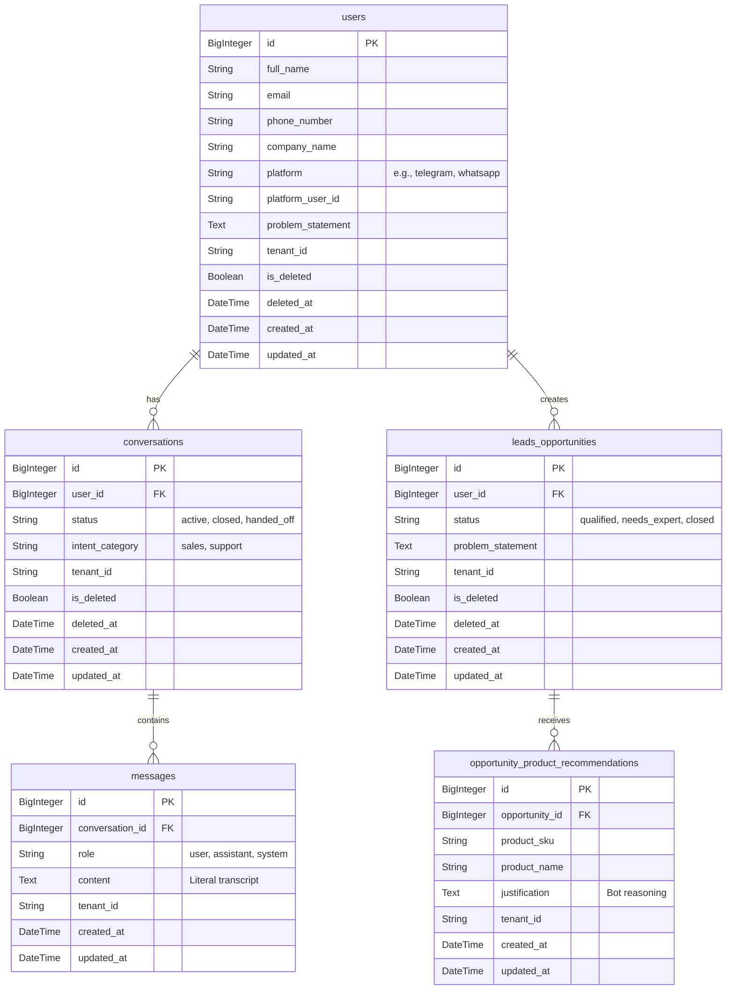

# Diagrama de Entidad-Relación (Base de Datos)

Este documento contiene la estructura relacional de la base de datos principal (`MySQL`), diseñada para soportar Multi-Tenant (Múltiples empresas SaaS) y un histórico detallado de conversaciones de ventas impulsadas por la IA.

